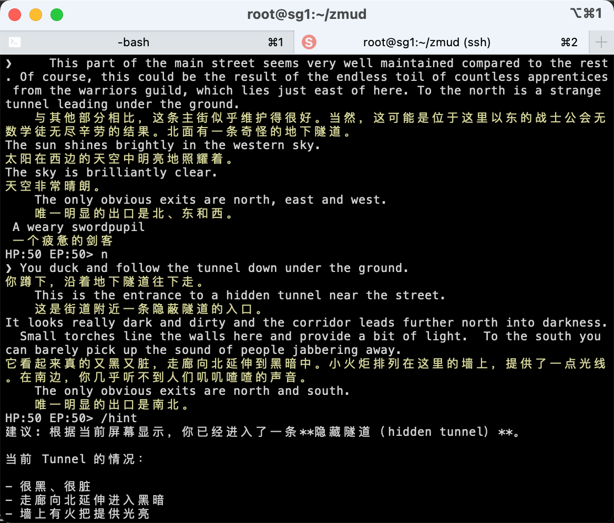

# zmud

一款专为 MUD 游戏打造的智能翻译终端, 帮中国玩家跨越语言障碍, 体验古老的英文Mud.  
结合AI助手, 大大缓解文字游戏难以上手的痛点.

## 功能特性

- 用 Go 语言实现的 Telnet 客户端
- 支持 Baidu、DeepSeek、Kilo 翻译引擎
- 向AI助手咨询任何问题, 或让AI自动给出最佳操作命令
- 翻译结果自动缓存，避免重复请求
- 批量翻译预热(warmup)，大幅提升翻译速度
- 自带热门游戏服务器列表，支持自定义添加删除游戏
- 上下键切换历史命令
- Tab 键自动补命令
- F1/F2 实时重绘当前屏幕, 秒切原文/译文/混合模式
- 支持gb/big5/utf-8编码, 支持中文mud
- 线性指令步进脚本引擎

## 系统命令

- /e [baidu|deepseek|kilo] - 切换翻译引擎
- /e update - 更新引擎参数
- /ask <问题> - 询问 AI 任何问题
- /hint - 根据最新上下文获取 AI 建议
- /quit - 退出游戏
- /alias - 打印列表，暂无别名时提示
- /alias key - 打印该别名
- /alias key DELETE - 删除别名
- /alias key value - 设置别名